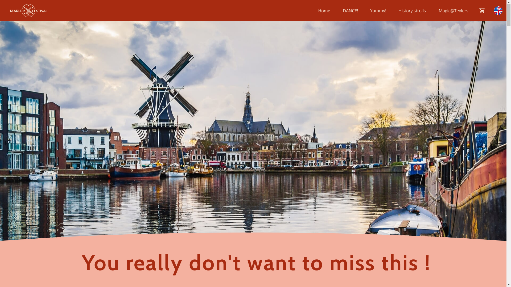

# The Haarlem Festival Website

## About

The Haarlem Festival website will serve as the primary digital platform for promoting and managing the festival's events, ticketing, and visitor engagement. This project encompasses the full implementation of the designed website, incorporating the required features and ensuring a seamless user experience.

This application is implemented using PHP with the MVC design pattern, leveraging relational databases for data management and ensuring a user-friendly and visually appealing interface using a CSS framework Bootstrap.



## Technical Implementation

- Backend:
  - PHP with MVC pattern for separation of concerns.
  - PDO for secure interaction with a MySQL relational database.
- Frontend:
  - HTML, CSS (using Bootstrap), and JavaScript for interactivity.
- Database:
  - Relational database design.
- API:
  - Implemented API endpoints.
- Version Control:
  - Code versioning using Git.
- Docker setup including:
  - PHP interpreter.
  - NGINX server.
  - MySQL (MariaDB) database.
  - PHP MyAdmin.
- A locally included routing utility: [https://github.com/steampixel/simplePHPRouter](https://github.com/steampixel/simplePHPRouter)

## Usage

- Start local

In a terminal, from the cloned/forked/download project folder, run:

```bash
docker compose up
```

NGINX will now serve files in the app/public folder. Visit localhost in your browser to check.
PHPMyAdmin is accessible on localhost:8080

If you want to stop the containers, press Ctrl+C.

Or run:

```bash
docker compose down
```

In PHPMyAdmin run SQL scripts from the [app/public/assets/docs/database_scripts.txt](app/public/assets/docs/database_scripts.txt) to create tables and populate them with data.